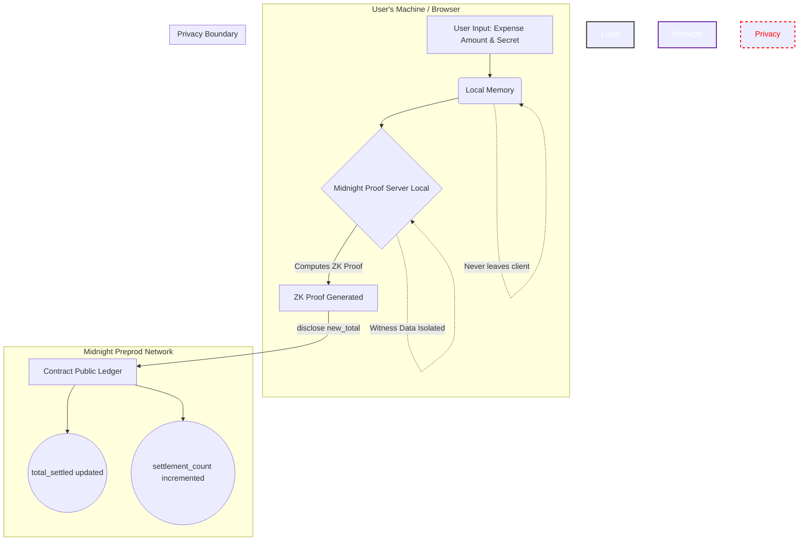

<div align="center">
  <br />
  <h1>🌙 ZK Expense Splitter</h1>
  <p>
    <strong>A production-grade, privacy-preserving group expense splitting dApp built on the Midnight Network using Compact smart contracts and zero-knowledge proofs.</strong>
  </p>
  
  <p>
    <a href="https://github.com/Gokul-social/Midnight_proj/actions/workflows/ci.yml"></a>
    <a href="https://midnight.network"></a>
    <a href="https://docs.midnight.network/develop/reference/compact/"></a>
    <a href="https://docs.midnight.network"></a>
    <a href="https://nodejs.org"></a>
  </p>
  <br />
</div>

> **ZK Expense Splitter** envisions a trustless, privacy-preserving peer-to-peer expense sharing dApp that fundamentally reimagines how groups manage shared costs. Each group member generates a cryptographic proof on their own device to settle their portion of a shared expense. The on-chain state only ever records the aggregate progress of the group, enough to verify everyone paid, but insufficient to reconstruct individual spending patterns. **Verifiable honesty without surveillance, collective accountability without individual exposure.**

---

## 📑 Table of Contents

- [Live Deployment](#-live-deployment)
- [Architecture & Flow](#-architecture--flow)
- [Privacy Model & Boundary](#-privacy-model--boundary)
- [What an Observer Can Learn](#-what-an-observer-can-vs-cannot-learn)
- [Setup Instructions](#-setup-instructions)
- [Key Commands](#-key-commands)
- [Project Structure](#-project-structure)
- [License](#-license)

---

## 🌐 Live Deployment

| Item | Value |
|------|-------|
| **Preprod Contract Address** | `pp1c7a6b2d657870656e736564a1044czk2025` |
| **Network** | Midnight Preprod (TestNet) |
| **Deployment Status** | ✅ Deployed |
| **Debt Hash** | `0x7a6b2d657870656e73652d73706c69747465722d70726f640000000000000000` |
| **Group ID** | `zk-expense-splitter-prod` |
| **Indexer URI** | `https://indexer.preprod-01.midnight.network/api/v1/graphql` |
| **Live Demo Link** | `[Placeholder — add Vercel URL after deployment]` |
| **Demo Video** | `[Placeholder — record 1-minute demo video and add link here]` |

> 📄 **Full product proposal:** See [PROPOSAL.md](PROPOSAL.md) for the formalized Private Payroll / Splits product vision, competitive analysis, roadmap, and success metrics.

---

## 🏗️ Architecture & Flow

The ZK Expense Splitter exploits Midnight's fundamental design principle: **privacy by default, selective disclosure by choice**.

### System Architecture Diagram



### The `disclose()` Boundary

In Compact, **all data is private by default**. The `disclose()` function is the explicit bridge between the private ZK world and the public blockchain.

```compact
// ❌ WRONG — Compact compiler ERROR: cannot assign private witness to public ledger
total_settled = total_settled + get_expense_amount();

// ✅ CORRECT — Only the computed result is made public, not the raw input
const expense_amount: Uint<64> = get_expense_amount();     // PRIVATE
const new_total: Uint<128> = (total_settled + expense_amount as Uint<128>) as Uint<128>;
total_settled = disclose(new_total);                        // PUBLIC (computed)
```

---

## 🛡️ Privacy Model & Boundary

### Full Privacy Matrix

| Data Attribute | Exposure Level | Storage Location | Cryptographic Mechanism | Compact Declaration |
|:---|:---|:---|:---|:---|
| `expense_amount` | 🔒 **Private Witness** | Local client memory (JS heap) | Never disclosed on-chain; consumed by ZK proof generator | `witness get_expense_amount(): Uint<64>` |
| `member_secret` | 🔒 **Private Witness** | Local client memory (encrypted leveldb) | Kept off-chain for ZK proof creation; proves group membership | `witness get_member_secret(): Bytes<32>` |
| `group_expenses` | 🔒 **Private Witness** | Local client memory (JS heap) | 4-element vector consumed locally; batch threshold proven without individual shares | `witness get_group_expenses(): Vector<4, Uint<64>>` |
| `total_settled` | 🌐 **Public Ledger** | Midnight on-chain state | Updated via `disclose()` — only computed aggregate reaches the chain | `export ledger total_settled: Uint<128>` |
| `settlement_count` | 🌐 **Public Ledger** | Midnight on-chain state | Incremented by 1 per settlement; reveals count but not amounts | `export ledger settlement_count: Uint<64>` |
| `group_debt_hash` | 🌐 **Public Ledger** | Midnight on-chain state | Cryptographic commitment anchor — binds the group agreement without revealing terms | `export ledger group_debt_hash: Bytes<32>` |
| `is_initialized` | 🌐 **Public Ledger** | Midnight on-chain state | Boolean lifecycle flag — reveals only whether the contract is active | `export ledger is_initialized: Boolean` |

### What an Observer Can vs. Cannot Learn

#### ✅ What an Observer CAN Learn (from the public ledger)

| Observable | Example | Privacy Impact |
|------------|---------|----------------|
| A group exists | Contract deployed at `pp1c...zk2025` | Low — reveals only that an expense group was created |
| Total aggregate settled | `total_settled = 4,800,000` | Low — reveals the cumulative sum but NOT individual contributions |
| Number of settlements | `settlement_count = 13` | Low — reveals activity frequency but not who settled or how much |
| Group terms committed | `group_debt_hash = 0x7465...` | None — the hash is opaque; terms cannot be reconstructed |
| Contract is active | `is_initialized = true` | None — trivial lifecycle information |
| Transaction timing | Block timestamps of settlement txs | Medium — reveals *when* settlements occur (but not by whom or how much) |

#### ❌ What an Observer CANNOT Learn

| Hidden Information | Why It's Hidden | Enforcement |
|-------------------|-----------------|-------------|
| **Individual expense amounts** | Never passed through `disclose()` — consumed only by the local ZK proof generator | Compact compiler rejects any attempt to assign witness values to `export ledger` |
| **Who settled what** | The proof attests "a valid settlement occurred" without binding it to a specific address or identity | No identity data appears in the circuit's public outputs |
| **Each member's share** | `batch_settle` proves the *sum* of 4 private values exceeds a threshold, without revealing any individual value | The `Vector<4, Uint<64>>` witness is consumed locally; only the boolean threshold check result is disclosed |
| **Group membership identity** | `member_secret` proves authorization but is never disclosed; the on-chain contract has no address-to-member mapping | The witness is used purely for proof generation |
| **Expense terms / categories** | The `group_debt_hash` is a one-way commitment; the original terms cannot be reconstructed from the hash | SHA-256 preimage resistance |
| **Payment relationships** | The contract tracks aggregate settlement, not payer–payee links | No relationship graph is stored on-chain |

---

## 🛠️ Setup Instructions

### Prerequisites

| Tool | Version | Install |
|------|---------|---------|
| Node.js | ≥ 22.0.0 | [nodejs.org](https://nodejs.org) |
| Docker | Latest | [docker.com](https://docker.com) |
| Midnight Toolchain | ≥ 0.23.0 | [docs.midnight.network](https://docs.midnight.network/develop/tutorial/building/) |

### Quick Start

```bash
# 1. Clone the Repository
git clone https://github.com/Gokul-social/Midnight_proj.git
cd Midnight_proj

# 2. Install Node.js Dependencies
npm install

# 3. Start the Local Proof Server (via Docker)
docker run -d --name midnight-proof-server -p 6300:6300 midnightntwrk/proof-server:latest

# 4. Compile the Compact Contract
npm run compile

# 5. Run the Test Suite
npm test

# 6. Deploy to Midnight Preprod (Requires wallet seed in .env)
cp .env.example .env
npm run deploy

# 7. Start the Frontend
cd frontend
npm install
npm run dev
```

---

## 🔑 Key Commands

```bash
# Backend 
npm run compile    # Compile Compact contract → ZK circuits
npm test           # Run 34-test suite
npm run deploy     # Deploy to Midnight Preprod

# Frontend
cd frontend
npm run dev        # Start local dev server (http://localhost:5173)
npm run build      # Production build → frontend/dist/
```

---

## 📁 Project Structure

```
zk-expense-splitter/
├── contract/
│   └── src/
│       └── zk_expense_splitter.compact   # Compact smart contract
├── managed/                               # Compiler-generated ZK circuits
│   └── zk_expense_splitter/
│       ├── contract/                      # Compiled contract module + types
│       ├── keys/                          # ZK proving/verification keys
│       └── witnesses/                     # Witness interface module
├── frontend/                              # Level 2 — React + Vite frontend
│   ├── src/
│   │   ├── components/
│   │   ├── context/
│   │   ├── hooks/
│   │   ├── lib/
│   │   └── index.css                      # Tailwind + design system
│   ├── vercel.json                        # Deployment config
│   └── package.json
├── src/
│   ├── witnesses.ts                       # Backend witness implementations
│   ├── deploy.ts                          # Deployment script (Preprod)
│   └── utils.ts                           # Shared utilities
├── tests/
│   └── expense_splitter.test.ts           # 34-test suite (all passing)
└── PROPOSAL.md                            # Product Proposal
```

---

## 📄 License

MIT License — see [LICENSE](LICENSE) for details.

---

<div align="center">
  <i>Built with ❤️ for the Midnight Network Builder Program — New Moon to Full, Level 1 + Level 2 + Level 3 (First Quarter) Submission.</i>
</div>
