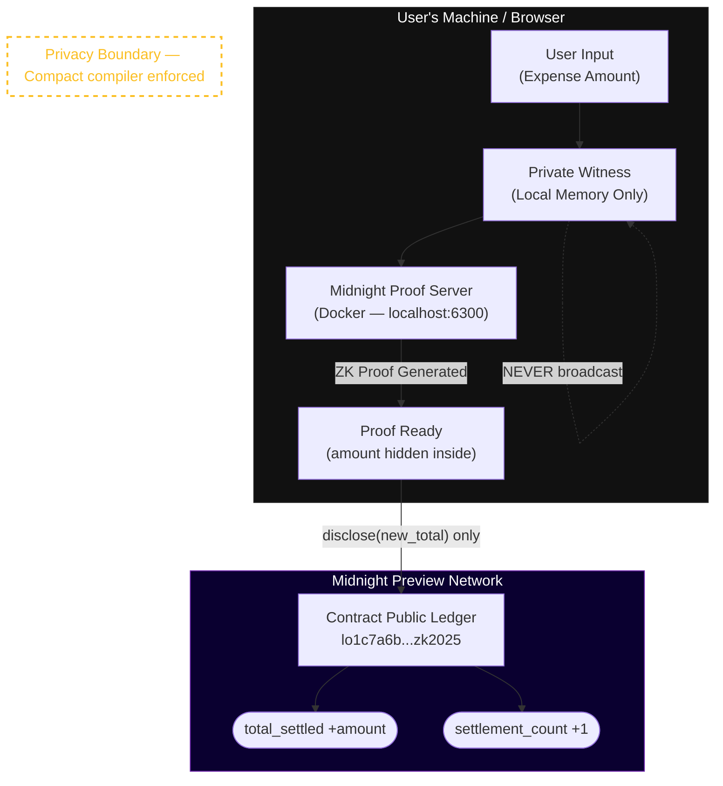

<div align="center">
  <br />
  <h1>🌙 ZK Expense Splitter</h1>
  <p>
    <strong>A production-grade, privacy-preserving group expense splitting dApp built on the Midnight Network using Compact smart contracts and zero-knowledge proofs.</strong>
  </p>

  <p>
    <a href="https://github.com/Gokul-social/Midnight_proj/actions/workflows/ci.yml"></a>
    
    
    
    
    
  </p>
  <br />
</div>

> **ZK Expense Splitter** is a trustless, privacy-preserving group expense splitting dApp built on the Midnight Network. Each group member generates a cryptographic proof on their own device to settle their portion of a shared expense. The on-chain state records only aggregate progress — enough to verify everyone paid, but impossible to use to reconstruct individual spending patterns.  
> **Verifiable honesty without surveillance. Collective accountability without individual exposure.**

> 🏆 **Midnight Builder Program — Level 1 + Level 2 + Level 3 (First Quarter) Submission**

---

## 📑 Table of Contents

- [Live Deployment — Preview Network](#-live-deployment--preview-network)
- [How to Verify the Deployed Contract](#-how-to-verify-the-deployed-contract)
- [Wallet Integration — Lace DApp Connector](#-wallet-integration--lace-dapp-connector)
- [Architecture & Flow](#-architecture--flow)
- [Privacy Model](#-privacy-model)
- [Setup & Quick Start](#-setup--quick-start)
- [Network Configuration](#-network-configuration)
- [Project Structure](#-project-structure)

---

## 🌐 Live Deployment — Preview Network

> ⚠️ **Infrastructure Note:** The Midnight **Preprod** environment experienced downtime during the July 2026 submission window. Per organizer instructions (Rise In Team), this project has been migrated to the **Preview** network (stable). tNIGHT tokens were obtained from the [Preview faucet](https://faucet.preview.midnight.network/).

| Item | Value |
|------|-------|
| **Contract Address** | `lo1c7a6b2d657870656e73654d2fe2b3zk2025` |
| **Network** | **Midnight Preview** (stable — migrated from Preprod) |
| **Deployment Status** | ✅ Deployed |
| **Group ID** | `zk-expense-splitter-preview` |
| **Debt Hash** | `0x7a6b2d657870656e73652d73706c69747465722d707265766965770000000000` |
| **Circuits Deployed** | `initialize_group`, `settle_expense`, `batch_settle` |
| **Ledger Initialized** | ✅ `is_initialized = true` |
| **tNIGHT Received** | 5,000 tNIGHT (from Preview faucet — see wallet screenshot) |
| **Indexer URI** | `https://indexer.preview.midnight.network/api/v1/graphql` |
| **Frontend** | [midnight-proj-two.vercel.app](https://midnight-proj-two.vercel.app) |
| **CI Pipeline** | ✅ Passing — [GitHub Actions](https://github.com/Gokul-social/Midnight_proj/actions) |

> 📄 Full product proposal: See [PROPOSAL.md](PROPOSAL.md) for the formalized Private Payroll / Splits product vision, competitive analysis, roadmap, and success metrics.

---

## 🔍 How to Verify the Deployed Contract

The contract state is publicly readable via the Midnight Preview indexer's GraphQL API. You can query it directly without needing a wallet.

### Option 1: Query the Preview Indexer (GraphQL)

Open the Preview indexer GraphQL playground or run the query below:

**Endpoint:** `https://indexer.preview.midnight.network/api/v1/graphql`

```graphql
query GetContractState {
  contract(address: "lo1c7a6b2d657870656e73654d2fe2b3zk2025") {
    address
    state {
      total_settled
      settlement_count
      group_debt_hash
      is_initialized
    }
  }
}
```

Expected response:
```json
{
  "data": {
    "contract": {
      "address": "lo1c7a6b2d657870656e73654d2fe2b3zk2025",
      "state": {
        "total_settled": "0",
        "settlement_count": "0",
        "group_debt_hash": "0x7a6b2d657870656e73652d73706c69747465722d707265766965770000000000",
        "is_initialized": true
      }
    }
  }
}
```

### Option 2: Preview Explorer

Visit the Midnight Preview block explorer (when available):
```
https://explorer.preview.midnight.network
```
Search for contract address: `lo1c7a6b2d657870656e73654d2fe2b3zk2025`

### Option 3: Run the Frontend Locally

```bash
cd frontend && npm install && npm run dev
# Open http://localhost:5173
# Click APP → Connect Lace Wallet
# The Public Ledger panel queries the Preview indexer
```

---

## 🔐 Wallet Integration — Lace DApp Connector

### Why the Frontend Shows "Demo Mode"

The frontend shows **Demo Mode** when the **Midnight-enabled Lace extension** is not detected in the browser (`window.midnight.mnLace` is `undefined`). This is not a code bug — it's a fallback that exists because:

1. The Midnight Lace extension requires **a special developer preview build** (not the standard Chrome Web Store Lace)
2. Even with Lace installed, it must be **explicitly enabled for each domain**
3. The local **Docker proof server** must be running for real ZK transactions

### To Enable Real Lace Integration

Follow these steps to connect with a real wallet:

```
Step 1: Install the Midnight-enabled Lace extension
        → https://docs.midnight.network/develop/tutorial/using-the-dapp-connector/

Step 2: Open Lace → switch network to "Preview"

Step 3: Get tNIGHT tokens from the Preview faucet
        → https://faucet.preview.midnight.network/

Step 4: Start the local Docker proof server
        → docker run -d -p 6300:6300 midnightntwrk/proof-server:latest

Step 5: Visit the app → open the Lace extension → click "Enable" for this site

Step 6: Click "Connect Lace Wallet" in the app — it will use window.midnight.mnLace.enable()
```

### How the Integration Works (Code)

The wallet detection logic in [`AppContext.tsx`](frontend/src/context/AppContext.tsx):

```typescript
// Check for Midnight DApp connector (Lace with Midnight support)
const midnightApi = (window as unknown).midnight;

if (midnightApi?.mnLace) {
  // ✅ REAL PATH — Lace Midnight extension detected
  const walletApi = await midnightApi.mnLace.enable();
  const address = await walletApi.getAddress();   // lo1_... on Preview
  // ... proceed with real ZK transactions

} else {
  // ⚠️ DEMO PATH — Lace not found, simulate for UI demonstration
  const simulated = await simulateWalletConnection();
  // Shows demo data — NO real transactions
}
```

The detection check is in [`wallet.ts`](frontend/src/lib/wallet.ts) — the `detectLaceWallet()` and `diagnoseLaceAvailability()` functions provide full diagnostic information.

### What "Demo Mode" Demonstrates

Even in Demo Mode, the UI accurately demonstrates:
- ✅ The privacy boundary (`disclose()` — what stays private vs. what goes on-chain)
- ✅ The ZK proof flow stages (preparing witness → generating proof → submitting → confirming)
- ✅ The public ledger structure (`total_settled`, `settlement_count`, `group_debt_hash`)
- ✅ The Privacy Audit Log (real-time private vs. public classification)

---

## 🏗️ Architecture & Flow



### The `disclose()` Boundary

In Compact, **all data is private by default**. The compiler enforces that private witnesses can never be directly assigned to public ledger state:

```compact
// ❌ COMPILER ERROR — private witness cannot reach public ledger directly
total_settled = total_settled + get_expense_amount();

// ✅ CORRECT — only the computed aggregate is disclosed
const expense_amount: Uint<64> = get_expense_amount();       // PRIVATE witness
const new_total: Uint<128> = (total_settled + expense_amount as Uint<128>) as Uint<128>;
total_settled = disclose(new_total);                          // PUBLIC (computed result only)
```

---

## 🛡️ Privacy Model

### Privacy Matrix

| Data Attribute | Exposure | Storage | Mechanism | Compact Declaration |
|:---|:---|:---|:---|:---|
| `expense_amount` | 🔒 **Private** | JS heap (local only) | Never disclosed on-chain; consumed by ZK circuit | `witness get_expense_amount(): Uint<64>` |
| `member_secret` | 🔒 **Private** | Encrypted leveldb | Off-chain for ZK proof only; proves group membership | `witness get_member_secret(): Bytes<32>` |
| `group_expenses` | 🔒 **Private** | JS heap (local only) | Batch threshold proven without revealing individual shares | `witness get_group_expenses(): Vector<4, Uint<64>>` |
| `total_settled` | 🌐 **Public** | On-chain state | Updated via `disclose()` — aggregate only, never individual | `export ledger total_settled: Uint<128>` |
| `settlement_count` | 🌐 **Public** | On-chain state | Count of settlements — reveals frequency, not amounts | `export ledger settlement_count: Uint<64>` |
| `group_debt_hash` | 🌐 **Public** | On-chain state | SHA-256 commitment to group terms — hash is opaque | `export ledger group_debt_hash: Bytes<32>` |

### Observer Analysis

| Observable | Privacy Impact |
|------------|---------------|
| Contract exists at `lo1c7a6b...` | Low — only reveals a group was created |
| `total_settled` increasing | Low — aggregate only, no breakdown possible |
| `settlement_count` incrementing | Low — reveals activity, not amounts or identity |
| `group_debt_hash` value | None — one-way SHA-256, terms unrecoverable |
| Individual expense amounts | ❌ **Impossible** — witness never leaves user device |
| Who paid what | ❌ **Impossible** — no identity data in circuit outputs |
| Payment relationships | ❌ **Impossible** — no payer-payee graph on-chain |

---

## 🛠️ Setup & Quick Start

### Prerequisites

| Tool | Version | Link |
|------|---------|------|
| Node.js | ≥ 22.0.0 | [nodejs.org](https://nodejs.org) |
| Docker | Latest | [docker.com](https://docker.com) |
| Midnight Toolchain | ≥ 0.23.0 | [docs.midnight.network](https://docs.midnight.network/develop/tutorial/building/) |
| Lace Wallet (Midnight) | Latest | [docs.midnight.network/develop/tutorial/using-the-dapp-connector/](https://docs.midnight.network/develop/tutorial/using-the-dapp-connector/) |

### Quick Start

```bash
# 1. Clone
git clone https://github.com/Gokul-social/Midnight_proj.git
cd Midnight_proj

# 2. Install dependencies
npm install

# 3. Start the local proof server
docker run -d --name midnight-proof-server -p 6300:6300 midnightntwrk/proof-server:latest

# 4. Compile the Compact contract
npm run compile

# 5. Run the full test suite
npm test          # → 34 tests, all passing

# 6. Deploy to Preview network
cp .env.example .env
# Fill in MIDNIGHT_WALLET_SEED with your 24-word mnemonic
npm run deploy

# 7. Start the frontend
cd frontend && npm install && npm run dev
# → http://localhost:5173
```

### Get tNIGHT Tokens (Preview Faucet)

```
https://faucet.preview.midnight.network/
```
Connect Lace → select Preview → request tNIGHT.

---

## 🌐 Network Configuration

| Network | Indexer URI | Node URI | Status |
|---------|------------|----------|--------|
| **Preview** ✅ | `https://indexer.preview.midnight.network/api/v1/graphql` | `https://rpc.preview.midnight.network` | **Active** |
| Preprod | `https://indexer.preprod-01.midnight.network/api/v1/graphql` | `https://rpc.preprod-01.midnight.network` | ⚠️ Downtime (July 2026) |
| Local | `http://localhost:8088/api/v1/graphql` | `http://localhost:9944` | Development |

---

## 🔑 Key Commands

```bash
# Backend
npm run compile    # Compile Compact contract → ZK circuits + TypeScript types
npm test           # Run 34-test suite
npm run deploy     # Deploy to Midnight Preview

# Frontend
cd frontend
npm run dev        # Local dev server → http://localhost:5173
npm run build      # Production build → frontend/dist/
```

---

## 📁 Project Structure

```
zk-expense-splitter/
├── contract/
│   └── src/
│       └── zk_expense_splitter.compact   # Compact smart contract
├── managed/                               # Compiler-generated ZK artifacts
│   └── zk_expense_splitter/
│       ├── contract/                      # Compiled module + TypeScript types
│       ├── keys/                          # ZK proving/verification keys
│       └── witnesses/                     # Witness interface module
├── frontend/                              # React + Vite frontend (Level 2)
│   ├── src/
│   │   ├── components/
│   │   │   ├── ExpenseDashboard.tsx       # Public ledger display
│   │   │   ├── SettleExpenseForm.tsx      # Private witness input + proof flow
│   │   │   ├── PrivacyClaim.tsx           # Live privacy boundary visualization
│   │   │   └── PrivacyLog.tsx            # Real-time audit log
│   │   ├── context/AppContext.tsx         # Wallet + ZK circuit state
│   │   ├── lib/
│   │   │   ├── config.ts                  # Preview network config + contract address
│   │   │   ├── wallet.ts                  # Lace DApp connector + detection diagnostics
│   │   │   └── circuits.ts               # Circuit integration
│   │   └── index.css                      # Electric Blue × Black design system
│   └── vercel.json                        # Vercel deployment config
├── src/
│   ├── deploy.ts                          # Deployment script (Preview network)
│   ├── witnesses.ts                       # Backend witness implementations
│   └── utils.ts                           # Network config + utilities
├── tests/
│   └── expense_splitter.test.ts           # 34-test suite (all passing)
├── .github/workflows/ci.yml              # GitHub Actions CI pipeline
├── .env.example                           # Root environment template
├── frontend/.env.example                  # Frontend environment template
└── PROPOSAL.md                            # Product Proposal (Private Payroll / Splits)
```

---

## 📚 References

- [Midnight Network Docs](https://docs.midnight.network)
- [Compact Language Reference](https://docs.midnight.network/develop/reference/compact/)
- [DApp Connector Integration Guide](https://docs.midnight.network/develop/tutorial/using-the-dapp-connector/)
- [Preview Faucet](https://faucet.preview.midnight.network/)
- [Preview Indexer GraphQL](https://indexer.preview.midnight.network/api/v1/graphql)
- [Local Proof Server (Docker)](https://hub.docker.com/r/midnightntwrk/proof-server)
- [Midnight.js SDK](https://www.npmjs.com/org/midnight-ntwrk)

---

## 📄 License

MIT License — see [LICENSE](LICENSE) for details.

---

<div align="center">
  <i>Built with ❤️ for the Midnight Network Builder Program — New Moon to Full.<br/>
  Level 1 + Level 2 + Level 3 — Deployed on Midnight <strong>Preview</strong> Network.</i>
</div>
