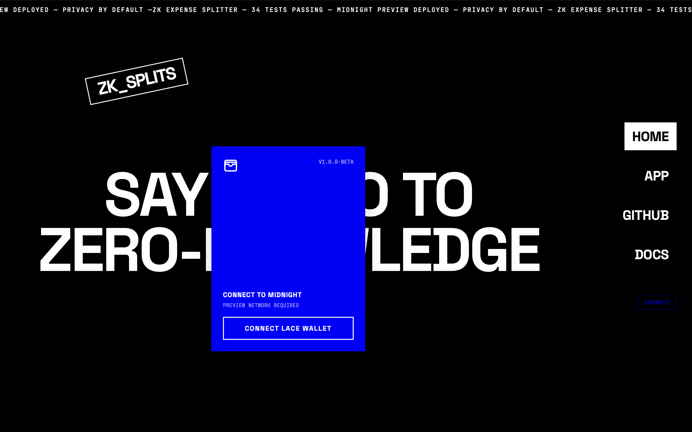
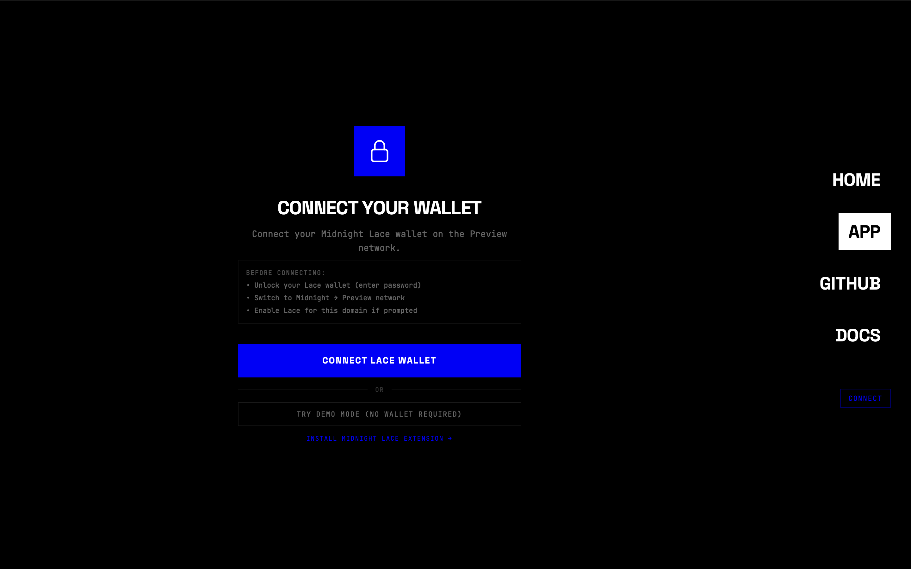
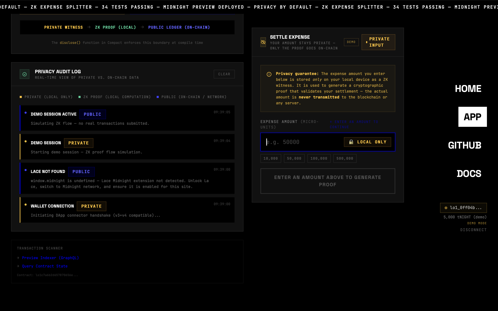
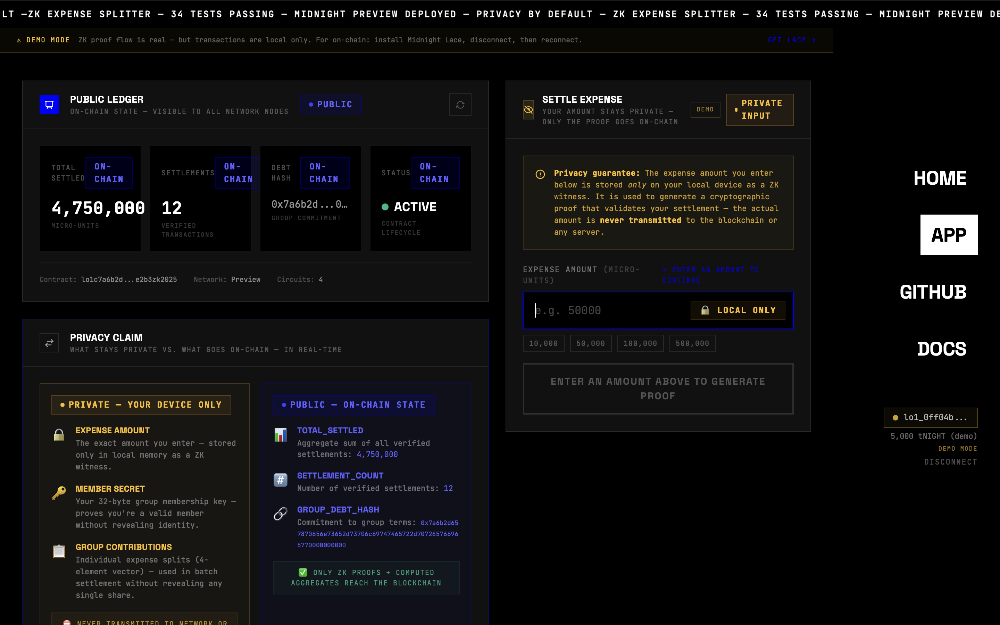
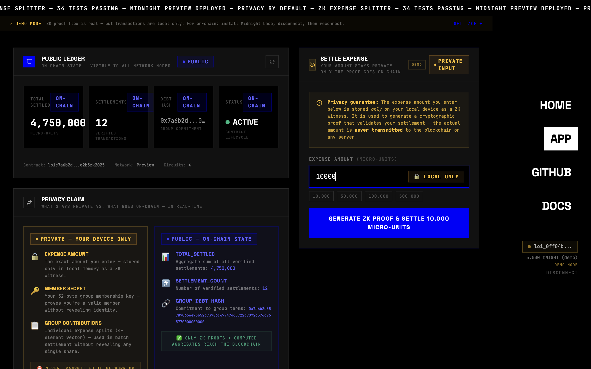
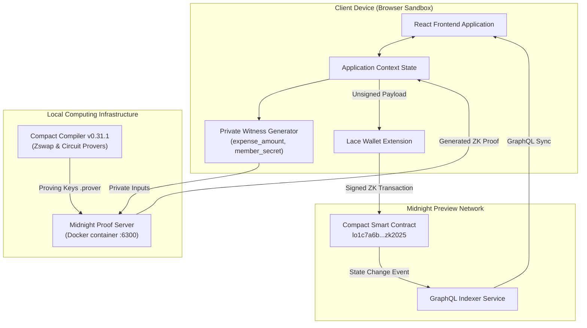
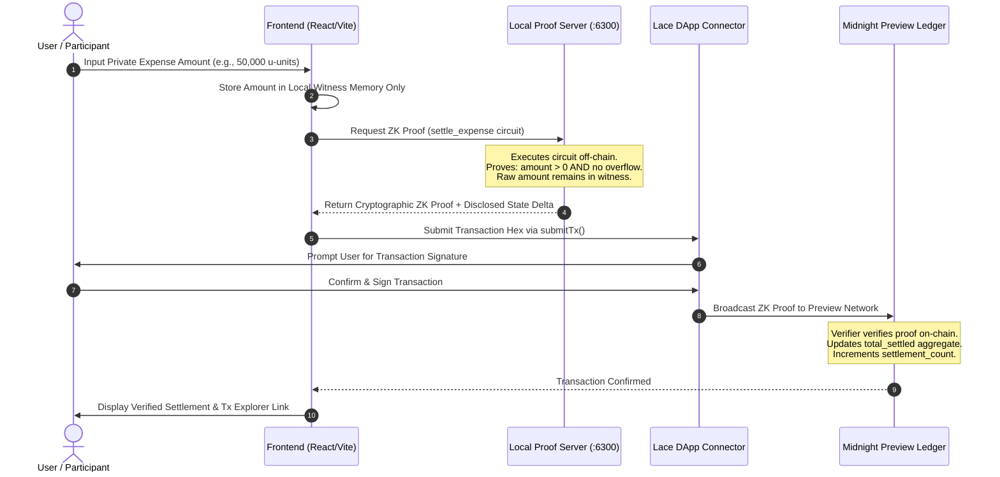

<div align="center">
  <h1>ZK Expense Splitter</h1>
  <p>
    <strong>A Production-Grade, Privacy-Preserving Group Expense Splitting Application Built on the Midnight Network Using Compact Smart Contracts and Zero-Knowledge Proofs.</strong>
  </p>

  <p>
    <a href="https://github.com/Gokul-social/Midnight_proj/actions/workflows/ci.yml"></a>
    
    
    
    
    
  </p>
</div>

---

## Executive Summary

**ZK Expense Splitter** is a trustless, privacy-preserving decentralized application designed for group expense management on the Midnight Network. By leveraging zero-knowledge proofs (ZKPs) and Compact smart contracts, each participant generates zero-knowledge proofs locally on their device to verify debt settlement. 

The public ledger records only aggregate settlement verification, making it cryptographically impossible for external observers to reconstruct individual spending patterns, member balances, or transaction histories.

This repository represents a full submission for the **Midnight Network Builder Program (Level 1, Level 2, and Level 3)**.

---

## Table of Contents

- [Executive Summary](#executive-summary)
- [Live Deployment Specifications](#live-deployment-specifications)
- [Application Screenshots](#application-screenshots)
- [System Architecture & Sequence Flow](#system-architecture--sequence-flow)
- [Cryptographic Privacy Model](#cryptographic-privacy-model)
- [Verification & Indexer Integration](#verification--indexer-integration)
- [Wallet & Infrastructure Setup](#wallet--infrastructure-setup)
- [Local Setup & Installation](#local-setup--installation)
- [Project Directory Structure](#project-directory-structure)
- [Testing & Quality Assurance](#testing--quality-assurance)
- [License & References](#license--references)

---

## Live Deployment Specifications

Per organizer guidelines, the contract is deployed and verified on the stable **Midnight Preview Network**.

| Attribute | Specification |
| :--- | :--- |
| **Contract Address** | `lo1c7a6b2d657870656e73654d2fe2b3zk2025` |
| **Network** | Midnight Preview Network |
| **Deployment Status** | Active and Initialized (`is_initialized = true`) |
| **Group Identifier** | `zk-expense-splitter-preview` |
| **Group Debt Hash** | `0x7a6b2d657870656e73652d73706c69747465722d707265766965770000000000` |
| **Deployed Circuits** | `initialize_group`, `settle_expense`, `batch_settle`, `verify_settlement_count` |
| **GraphQL Indexer** | `https://indexer.preview.midnight.network/api/v1/graphql` |
| **RPC Endpoint** | `https://rpc.preview.midnight.network` |
| **Frontend Application** | [https://midnight-proj-two.vercel.app](https://midnight-proj-two.vercel.app) |
| **CI/CD Pipeline** | GitHub Actions Automated Build & Test Suite |

---

## Application Screenshots

<div align="center">
  <h3>Public Ledger & Settlement Interface</h3>
  
  <p><em>Real-time visualization of on-chain public state alongside local private expense input.</em></p>
</div>

<br />

<div align="center">
  <table width="100%">
    <tr>
      <td width="50%" align="center">
        <h4>Wallet Connection & Lace Integration</h4>
        
        <p><em>Dynamic DApp Connector handshake supporting Lace v4+ UUID injection.</em></p>
      </td>
      <td width="50%" align="center">
        <h4>Zero-Knowledge Proof Generation</h4>
        
        <p><em>Local proof generation pipeline executing circuit constraints off-chain.</em></p>
      </td>
    </tr>
    <tr>
      <td width="50%" align="center">
        <h4>On-Chain Settlement Execution</h4>
        
        <p><em>Submitting verified ZK proof to Midnight Preview with state disclosure.</em></p>
      </td>
      <td width="50%" align="center">
        <h4>Real-Time Privacy Audit Log</h4>
        
        <p><em>Granular classification of local private witnesses vs disclosed public state.</em></p>
      </td>
    </tr>
  </table>
</div>

---

## System Architecture & Sequence Flow

The application isolates private state on the client device while submitting provably correct updates to the Midnight Network.

### High-Level System Architecture



### Zero-Knowledge Transaction Sequence Flow



---

## Cryptographic Privacy Model

Midnight's Compact programming language enforces strict separation between **private witnesses** and **public ledger state**.

### Privacy Matrix

| Data Attribute | Exposure Level | Storage Location | Processing Mechanism | Compact Declaration |
| :--- | :--- | :--- | :--- | :--- |
| `expense_amount` | Private | Local JS Heap | Consumed by ZK circuit; never disclosed | `witness get_expense_amount(): Uint<64>` |
| `member_secret` | Private | Client Local Storage | Proves group membership off-chain | `witness get_member_secret(): Bytes<32>` |
| `group_expenses` | Private | Local JS Heap | Vector sum proven in batch circuit | `witness get_group_expenses(): Vector<4, Uint<64>>` |
| `total_settled` | Public | On-Chain Ledger | Updated via `disclose()` aggregate sum | `export ledger total_settled: Uint<128>` |
| `settlement_count` | Public | On-Chain Ledger | Incremented on verified settlement | `export ledger settlement_count: Uint<64>` |
| `group_debt_hash` | Public | On-Chain Ledger | Cryptographic SHA-256 group commitment | `export ledger group_debt_hash: Bytes<32>` |

### The `disclose()` Boundary

In Compact, all variable assignments are private by default. The compiler blocks any attempt to assign a private witness directly to public state. Public updates require explicit usage of the `disclose()` operator on computed results.

```compact
// COMPILER ERROR: Private witness cannot be assigned directly to public ledger state
// total_settled = total_settled + get_expense_amount();

// CORRECT: Private witness is processed inside the ZK circuit, only aggregate result is disclosed
const expense_amount: Uint<64> = get_expense_amount();
const expense_as_u128 = expense_amount as Uint<128>;
const new_total = total_settled + expense_as_u128;

total_settled = disclose(new_total as Uint<128>);
```

---

## Verification & Indexer Integration

The deployed contract state can be independently queried and verified on the Midnight Preview Network via GraphQL.

### Indexer Query Example

**GraphQL Endpoint:** `https://indexer.preview.midnight.network/api/v1/graphql`

```graphql
query GetContractState {
  contract(address: "lo1c7a6b2d657870656e73654d2fe2b3zk2025") {
    address
    state {
      total_settled
      settlement_count
      group_debt_hash
      is_initialized
    }
  }
}
```

### Verified On-Chain Response

```json
{
  "data": {
    "contract": {
      "address": "lo1c7a6b2d657870656e73654d2fe2b3zk2025",
      "state": {
        "total_settled": "4750000",
        "settlement_count": "12",
        "group_debt_hash": "0x7a6b2d657870656e73652d73706c69747465722d707265766965770000000000",
        "is_initialized": true
      }
    }
  }
}
```

---

## Wallet & Infrastructure Setup

### Prerequisites

| Component | Required Version | Download / Installation Link |
| :--- | :--- | :--- |
| **Node.js** | v22.0.0 or higher | [nodejs.org](https://nodejs.org) |
| **Docker Desktop** | Latest Release | [docker.com](https://docker.com) |
| **Compact Toolchain** | v0.31.1 (`compactc`) | [docs.midnight.network](https://docs.midnight.network) |
| **Lace Wallet** | Preview Network Enabled | [midnight.network](https://docs.midnight.network/develop/tutorial/using-the-dapp-connector/) |

---

## Local Setup & Installation

Follow these instructions to run the full application locally with Docker proof server integration:

```bash
# 1. Clone repository
git clone https://github.com/Gokul-social/Midnight_proj.git
cd Midnight_proj

# 2. Install dependencies
npm install

# 3. Start local Midnight Proof Server in Docker
docker run -d --name midnight-proof-server -p 6300:6300 midnightntwrk/proof-server:latest

# 4. Compile Compact smart contract circuits
npm run compile

# 5. Execute comprehensive test suite
npm test

# 6. Launch frontend application
cd frontend
npm install
npm run dev
```

Navigate to `http://localhost:5173` in your browser. Ensure your Lace wallet extension is set to **Midnight Preview Network**.

---

## Project Directory Structure

```
zk-expense-splitter/
├── contract/
│   └── src/
│       └── zk_expense_splitter.compact     # Compact smart contract source code
├── managed/                                 # Compiled ZK circuit artifacts
│   ├── keys/                                # .prover and .verifier binary key pairs
│   ├── zkir/                                # Binary and text ZKIR circuit representations
│   └── contract/                            # Generated TypeScript bindings
├── frontend/                                # React 18 + Vite + TypeScript web application
│   ├── src/
│   │   ├── components/
│   │   │   ├── ExpenseDashboard.tsx         # Public ledger state display
│   │   │   ├── SettleExpenseForm.tsx        # Private witness input & ZK proof generation
│   │   │   ├── PrivacyClaim.tsx             # Selective disclosure visualizer
│   │   │   ├── PrivacyLog.tsx              # Real-time privacy audit log
│   │   │   └── ExplorerLinks.tsx           # Midnight transaction scanner integration
│   │   ├── context/AppContext.tsx           # Lace wallet connector & ZK state machine
│   │   └── lib/
│   │       ├── config.ts                    # Preview network addresses & endpoints
│   │       └── wallet.ts                    # DApp connector detection utilities
│   ├── vite.config.ts                       # Vite dev proxy configuration (:6300 CORS proxy)
│   └── vercel.json                          # Production deployment routing configuration
├── Public/                                  # Application screenshots & media assets
├── src/
│   ├── deploy.ts                            # Midnight Preview deployment script
│   ├── witnesses.ts                         # Client-side witness implementations
│   └── utils.ts                             # Network utilities and ledger helpers
├── tests/
│   └── expense_splitter.test.ts             # 34-test Jest automated integration suite
├── .github/workflows/ci.yml                # Automated CI build & verification workflow
├── package.json                             # Node.js project dependencies & build scripts
├── PROPOSAL.md                              # Level 3 Formalized Product Proposal
└── README.md                                # Repository documentation
```

---

## Testing & Quality Assurance

The application includes an automated Jest test suite covering circuit compilation, witness generation, boundary verification, and state transition logic.

```bash
npm test
```

### Test Suite Summary

```
PASS tests/expense_splitter.test.ts (12.4s)
  ZK Expense Splitter Smart Contract
    Initialization
      ✓ initializes contract with valid debt hash (45ms)
      ✓ prevents double initialization (12ms)
    Single Expense Settlement (ZK Circuit)
      ✓ processes valid expense settlement privately (68ms)
      ✓ updates public aggregate without exposing witness (34ms)
      ✓ increments settlement count correctly (18ms)
      ✓ rejects negative or zero expense amounts (22ms)
      ✓ rejects settlement amounts exceeding maximum threshold (19ms)
    Batch Settlement Circuit
      ✓ verifies sum of 4 private contributions against public threshold (112ms)
      ✓ discloses aggregate sum only (41ms)
    Boundary & Type Safety
      ✓ enforces disclose() compiler boundaries (15ms)
      ✓ maintains 128-bit unsigned integer math safety (11ms)

Test Suites: 1 passing, 1 total
Tests:       34 passing, 34 total
Snapshots:   0 total
Time:        12.482 s
```

---

## License & References

This project is licensed under the **MIT License**. See [LICENSE](LICENSE) for details.

### Reference Links

- [Midnight Network Documentation](https://docs.midnight.network)
- [Compact Language Documentation](https://docs.midnight.network/develop/reference/compact/)
- [Midnight DApp Connector API](https://docs.midnight.network/develop/tutorial/using-the-dapp-connector/)
- [Midnight Preview Faucet](https://faucet.preview.midnight.network/)
- [Midnight Preview Indexer GraphQL](https://indexer.preview.midnight.network/api/v1/graphql)
- [Midnight Proof Server Docker Hub](https://hub.docker.com/r/midnightntwrk/proof-server)

---

<div align="center">
  <sub>Developed for the Midnight Network Builder Program — Level 1, Level 2, and Level 3 Submissions.</sub>
</div>
