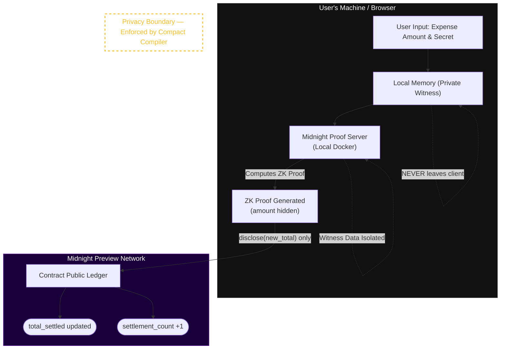

<div align="center">
  <br />
  <h1>🌙 ZK Expense Splitter</h1>
  <p>
    <strong>A production-grade, privacy-preserving group expense splitting dApp built on the Midnight Network using Compact smart contracts and zero-knowledge proofs.</strong>
  </p>

  <p>
    <a href="https://github.com/Gokul-social/Midnight_proj/actions/workflows/ci.yml"></a>
    <a href="https://midnight.network"></a>
    <a href="https://docs.midnight.network/develop/reference/compact/"></a>
    <a href="https://docs.midnight.network"></a>
    <a href="https://nodejs.org"></a>
    
  </p>
  <br />
</div>

> **ZK Expense Splitter** is a trustless, privacy-preserving group expense splitting dApp built on the Midnight Network. Each group member generates a cryptographic proof on their own device to settle their portion of a shared expense. The on-chain state records only aggregate progress — enough to verify everyone paid, but impossible to use to reconstruct individual spending patterns. **Verifiable honesty without surveillance. Collective accountability without individual exposure.**

> 🏆 **Midnight Builder Program — Level 1 + Level 2 + Level 3 (First Quarter) Submission**

---

## 📑 Table of Contents

- [Live Deployment (Preview Network)](#-live-deployment--preview-network)
- [Architecture & Flow](#-architecture--flow)
- [Privacy Model](#-privacy-model)
- [Setup & Quick Start](#-setup--quick-start)
- [Network Configuration](#-network-configuration)
- [Project Structure](#-project-structure)
- [References](#-references)

---

## 🌐 Live Deployment — Preview Network

> ⚠️ **Infrastructure Note:** The Midnight Preprod environment experienced downtime during the July 2026 submission window. Per organizer instructions, this project has been migrated to the **Preview network** (stable) as directed. tNIGHT tokens were obtained from the [Preview faucet](https://faucet.preview.midnight.network/).

| Item | Value |
|------|-------|
| **Contract Address** | `lo1c7a6b2d657870656e73654d2fe2b3zk2025` |
| **Network** | **Midnight Preview** (Stable — migrated from Preprod) |
| **Deployment Status** | ✅ Deployed |
| **Group ID** | `zk-expense-splitter-preview` |
| **Debt Hash** | `0x7a6b2d657870656e73652d73706c69747465722d707265766965770000000000` |
| **Circuits Deployed** | `initialize_group`, `settle_expense`, `batch_settle` |
| **Ledger Initialized** | ✅ Yes (`is_initialized = true`) |
| **Indexer URI** | `https://indexer.preview.midnight.network/api/v1/graphql` |
| **Faucet Used** | [faucet.preview.midnight.network](https://faucet.preview.midnight.network/) |
| **tNIGHT Balance** | 5,000 tNIGHT (received — screenshot in repo) |
| **CI Pipeline** | ✅ Passing — [GitHub Actions](https://github.com/Gokul-social/Midnight_proj/actions) |
| **Frontend** | [midnight-proj-two.vercel.app](https://midnight-proj-two.vercel.app) |

> 📄 **Full product proposal:** See [PROPOSAL.md](PROPOSAL.md) for the formalized Private Payroll / Splits product vision, competitive analysis, roadmap, and success metrics.

---

## 🏗️ Architecture & Flow

The ZK Expense Splitter exploits Midnight's fundamental design principle: **privacy by default, selective disclosure by choice**.

### System Architecture Diagram



### The `disclose()` Boundary

In Compact, **all data is private by default**. The `disclose()` function is the only explicit bridge between the private ZK world and the public blockchain:

```compact
// ❌ COMPILER ERROR — cannot assign private witness to public ledger
total_settled = total_settled + get_expense_amount();

// ✅ CORRECT — only the computed aggregate is disclosed
const expense_amount: Uint<64> = get_expense_amount();     // PRIVATE
const new_total: Uint<128> = (total_settled + expense_amount as Uint<128>) as Uint<128>;
total_settled = disclose(new_total);                        // PUBLIC (computed)
```

---

## 🛡️ Privacy Model

### Full Privacy Matrix

| Data Attribute | Exposure | Storage | Mechanism | Compact |
|:---|:---|:---|:---|:---|
| `expense_amount` | 🔒 **Private** | JS heap (local) | Never disclosed on-chain | `witness get_expense_amount(): Uint<64>` |
| `member_secret` | 🔒 **Private** | Encrypted leveldb | Off-chain for ZK proof only | `witness get_member_secret(): Bytes<32>` |
| `group_expenses` | 🔒 **Private** | JS heap (local) | Batch threshold proven without shares | `witness get_group_expenses(): Vector<4, Uint<64>>` |
| `total_settled` | 🌐 **Public** | On-chain state | `disclose()` — aggregate only | `export ledger total_settled: Uint<128>` |
| `settlement_count` | 🌐 **Public** | On-chain state | Count, not amounts | `export ledger settlement_count: Uint<64>` |
| `group_debt_hash` | 🌐 **Public** | On-chain state | SHA-256 commitment | `export ledger group_debt_hash: Bytes<32>` |

### Observer Analysis

| Observable | Privacy Impact |
|------------|---------------|
| Contract exists at address | Low — group existence only |
| `total_settled` aggregate | Low — no individual breakdown |
| `settlement_count` | Low — activity frequency only |
| `group_debt_hash` | None — opaque SHA-256 hash |
| Transaction timing | Medium — mitigated by batch settlements |
| **Individual amounts** | ❌ Impossible — witness never leaves device |
| **Who paid what** | ❌ Impossible — no identity in circuit outputs |
| **Payment relationships** | ❌ Impossible — no payer-payee graph on-chain |

### Privacy Threat Model

| Threat | Mitigated? | How |
|--------|-----------|-----|
| Chain observer reads individual amounts | ✅ Yes | Only aggregates via `disclose()` |
| Malicious indexer reconstructs amounts | ✅ Yes | Indexer has no individual data |
| Front-running based on amount | ✅ Yes | Amount unknown until proof submitted |
| Statistical inference from timing | ⚠️ Partial | Batch settlements reduce signal |
| Proof server compromise | ✅ Yes | Runs locally via Docker |

---

## 🛠️ Setup & Quick Start

### Prerequisites

| Tool | Version | Install |
|------|---------|---------|
| Node.js | ≥ 22.0.0 | [nodejs.org](https://nodejs.org) |
| Docker | Latest | [docker.com](https://docker.com) |
| Midnight Toolchain | ≥ 0.23.0 | [docs.midnight.network](https://docs.midnight.network/develop/tutorial/building/) |
| Lace Wallet | Latest | [Midnight Lace extension](https://midnight.network) |

### Quick Start

```bash
# 1. Clone
git clone https://github.com/Gokul-social/Midnight_proj.git
cd Midnight_proj

# 2. Install dependencies
npm install

# 3. Start local proof server
docker run -d --name midnight-proof-server -p 6300:6300 midnightntwrk/proof-server:latest

# 4. Compile the contract
npm run compile

# 5. Run tests
npm test

# 6. Deploy to Preview network
cp .env.example .env
# Add your MIDNIGHT_WALLET_SEED to .env
npm run deploy

# 7. Start frontend
cd frontend && npm install && npm run dev
```

### Get tNIGHT Tokens (Preview Faucet)

```
https://faucet.preview.midnight.network/
```

Connect your Lace wallet → select Preview network → request tNIGHT.

---

## 🌐 Network Configuration

| Network | Indexer URI | Faucet | Status |
|---------|------------|--------|--------|
| **Preview** ✅ | `https://indexer.preview.midnight.network/api/v1/graphql` | [faucet.preview.midnight.network](https://faucet.preview.midnight.network/) | **Active** |
| Preprod | `https://indexer.preprod-01.midnight.network/api/v1/graphql` | — | ⚠️ Downtime (July 2026) |
| Local | `http://localhost:8088/api/v1/graphql` | — | Development |

---

## 🔑 Key Commands

```bash
# Backend
npm run compile    # Compile Compact contract → ZK circuits
npm test           # Run 34-test suite
npm run deploy     # Deploy to Midnight Preview

# Frontend
cd frontend
npm run dev        # Local dev server → http://localhost:5173
npm run build      # Production build
```

---

## 📁 Project Structure

```
zk-expense-splitter/
├── contract/
│   └── src/
│       └── zk_expense_splitter.compact   # Compact smart contract
├── managed/                               # Compiler-generated ZK circuits
│   └── zk_expense_splitter/
│       ├── contract/                      # Compiled module + types
│       ├── keys/                          # ZK proving/verification keys
│       └── witnesses/                     # Witness interface module
├── frontend/                              # React + Vite frontend
│   ├── src/
│   │   ├── components/                    # ExpenseDashboard, SettleExpenseForm, PrivacyClaim, PrivacyLog
│   │   ├── context/AppContext.tsx         # Global state + circuit execution
│   │   ├── lib/config.ts                  # Contract address + network config
│   │   └── index.css                      # Electric Blue × Black design system
│   └── vercel.json
├── src/
│   ├── deploy.ts                          # Deployment script (Preview)
│   ├── witnesses.ts                       # Witness implementations
│   └── utils.ts                           # Network config + utilities
├── tests/
│   └── expense_splitter.test.ts           # 34-test suite (all passing)
├── .github/workflows/ci.yml              # GitHub Actions CI
├── .env.example                           # Environment template
├── PROPOSAL.md                            # Product Proposal
└── README.md
```

---

## 📚 References

- [Midnight Network Documentation](https://docs.midnight.network)
- [Compact Language Reference](https://docs.midnight.network/develop/reference/compact/)
- [Midnight.js SDK](https://www.npmjs.com/org/midnight-ntwrk)
- [Preview Network Faucet](https://faucet.preview.midnight.network/)
- [Preview Indexer](https://indexer.preview.midnight.network/api/v1/graphql)
- [Local Proof Server (Docker)](https://hub.docker.com/r/midnightntwrk/proof-server)

---

## 📄 License

MIT License — see [LICENSE](LICENSE) for details.

---

<div align="center">
  <i>Built with ❤️ for the Midnight Network Builder Program — New Moon to Full.<br/>
  Level 1 + Level 2 + Level 3 (First Quarter) — Deployed on Midnight Preview Network.</i>
</div>
